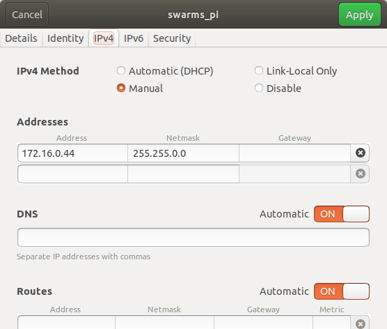

# Swarms Xbox interface
Generates an interface between Swarms input device and an userland Xpad device.

## Getting Started

### Prerequisites
To employ the Swarms input device with Qgroundcontrol, the Swarms input device has to be masked as recognized gamepad controller, like the Xbox 360-controller.

- [xboxdrv](https://pingus.seul.org/~grumbel/xboxdrv/)
- python 2.7 with [python-evdev](http://python-evdev.readthedocs.io/en/latest/install.html)

### Connection with the Swarms input device
The Swarms input device employ an ethernet interface. The input device consists of two Raspberry Pi machines; the main machine has the local IP-address ```172.16.0.12```. As of May 2018 the username and password for the machine is the Raspberry Pi default. To ssh into the input device the wired connection needs to be properly set-up:



In the terminal window the input device can be accessed by ssh-connection.
```[bash]
ssh pi@172.16.0.12
```

The machine doesn't send out signals by default. In the home directory there's a shell script that accesess the RPi.GPIO Python library:
```[bash]
./start_local.sh
```

This script sends a JSON-list through UDP-packets.

